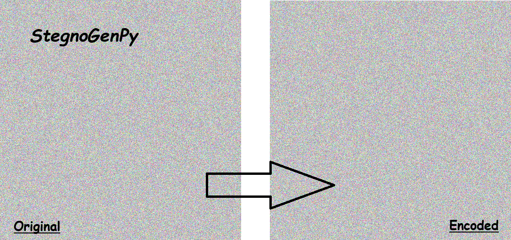

# StegnoGenPy



 StegnoGenPy is a proof-of-concept app for embedding text in randomly generated images (color/greyscale) using steganography. It obfuscates text with base64 and hashing for added security. The tool supports encoding and decoding, offering a basic, secure way to hide and retrieve information in images.


## Usage
TBA


## Requirements
To get started, ensure you have all the necessary dependencies. You can install them using the following command:
```
pip install -r requirements.txt
```

## Setup Virtual Environment
In the console or terminal, type `python -m venv venv` to initialize the python virtual environment. In linux, you might have to run `sudo apt update && apt update -y` to install pip for later uses.
```
# Windows Users
.\venv\Scripts\activate

# Unix/ Mac Users
source venv/bin/activate

# Exit venv Command
deactivate

```-